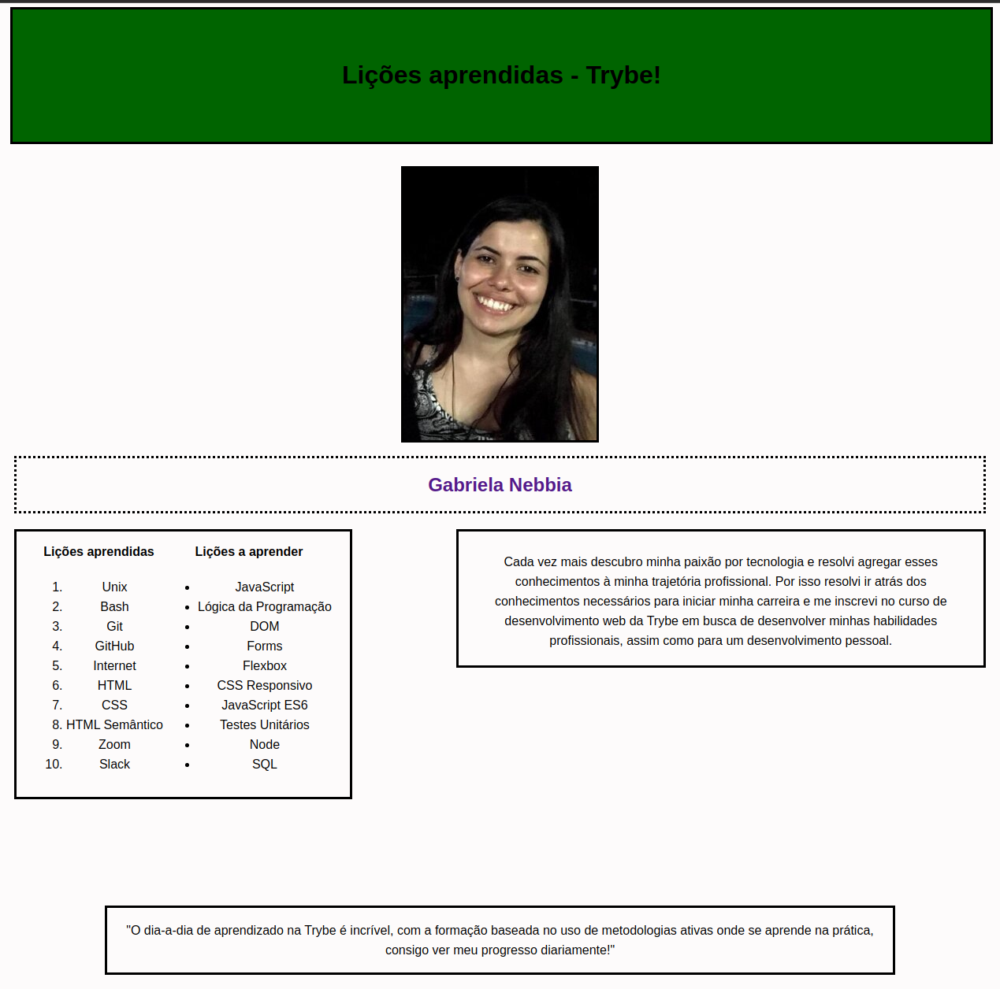

## Projeto Lessons Learned

### Sobre

Nesse projeto foi desenvolvida uma página HTML contendo informações sobre o que havia aprendido durante o curso da Trybe ao longo dos primeiros blocos. Os elementos foram posicionados e estilizados com CSS e box model. Além disto, uma semântica apropriada segundo a verificação do site [achecker](https://achecker.ca/checker/index.php), para que seja acessível e melhor ranqueado.

---

### Habilidades

- Entender como funciona a estrutura (HTML) de uma página
- Entender como o estilo (CSS) é aplicado à página
- Construir páginas utilizando HTML e CSS
- Realizar manutenções em páginas já existentes
- Aplicar Layout e Box Model na prática

---

### Implementações

  1. Adiciona uma cor de fundo à página
  2. Adiciona uma barra superior com título
  3. Adiciona uma foto de perfil
  4. Adiciona uma lista de lições aprendidas
  5. Cria uma lista com lições a serem aprendidas
  6. Adiciona um rodapé
  7. Insere pelo menos um link externo
  8. Cria um artigo sobre meu aprendizado
  9. Cria uma seção que conta uma passagem sobre os aprendizado
  10. Aplica os elementos HTML(article, header, nav, section, aside e footer) de acordo com o sentido e propósito de cada um deles
  11. Testa a semântica da página pelo site achecker
  12. Adiciona uma tabela à página
  13. Utiliza o Box model
  14. Altera os atributos relacionados as fontes
  15. Posiciona o artigo e a seção sobre aprendizados um ao lado do outro

---

### Resultado

