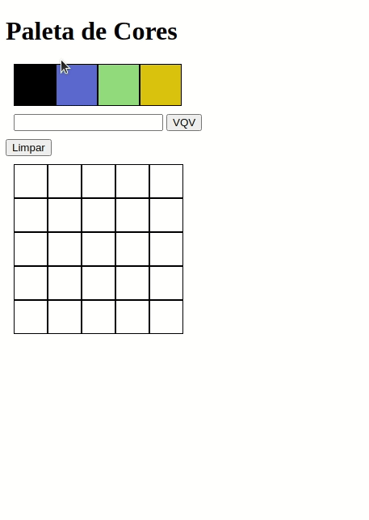

## Projeto Pixel Art

### Sobre

Nesse projeto foi desenvolvida uma página web que contém uma paleta de cores e um quadro que pode ser utilizados para criar desenhos em pixels.

---

### Habilidades

- Aderência à especificação e organização do código
- Estruturar corretamente uma página HTML e o CSS
- Manipular o DOM com JavaScript para adicionar interatividade à página

---

### Tecnologias utilizadas

- `HTML`
- `CSS`
- `JavaScript`

---

### Implementações

1. Adiciona à página o título "Paleta de Cores"
2. Adiciona à página uma paleta de quatro cores distintas
3. Adiciona na página a cor preta como a primeira na paleta de cores
4. Adiciona à página um quadro de pixels, com 25 pixels
5. Faz com que cada elemento do quadro de pixels possua 40 pixels de largura, 40 pixels de altura e seja delimitado por uma borda preta de 1 pixel
6. Define a cor preta como cor inicial. Ao carregar a página a cor preta já deve estar selecionada para pintar os pixels
7. Seleciona uma das cores da paleta, ao clicar, a cor selecionada é a que será utilizada para preencher os pixels no quadro
8. Clicar em um pixel dentro do quadro após selecionar uma cor na paleta, faz com que o pixel seja preenchido com a cor selecionada
9. Cria um botão que, ao ser clicado, limpa o quadro preenchendo a cor de todos seus pixels com branco
10. Faz o quadro de pixels ter seu tamanho definido pelo usuário
11. Limita o tamanho do mínimo e máximo do board
12. Faz com que as cores da paleta sejam geradas aleatoriamente ao carregar a página

---

### Resultado

