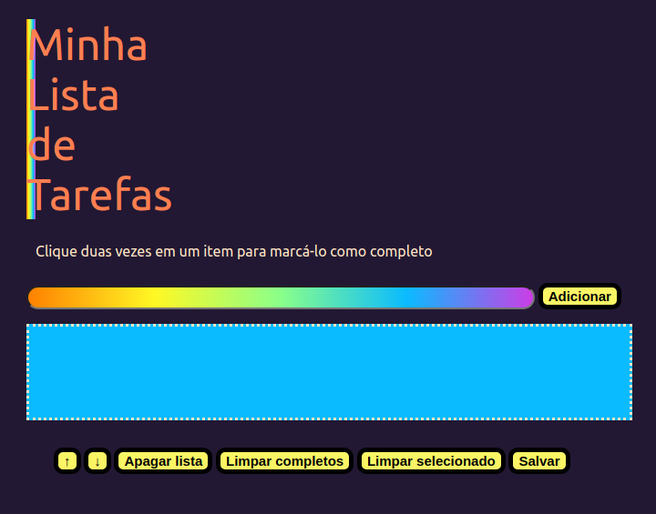

## Projeto Todo List

### Sobre

Nesse projeto foi desenvolvida uma página web para a criação e manipulação de uma lista de tarefas.

---

### Habilidades

- Aderência à especificação e organização do código
- Estruturar corretamente uma página HTML e o CSS
- Manipular o DOM com JavaScript para adicionar interatividade à página

---

### Tecnologias utilizadas

- `HTML`
- `CSS`
- `JavaScript`

---

### Implementações

1. Adiciona à lista o título "Minha Lista de Tarefas" em uma tag
2. Adiciona abaixo do título um pequeno e discreto parágrafo com id="funcionamento" e com o texto "Clique duas vezes em um item para marcá-lo como completo"
3. Adiciona um input com o id="texto-tarefa" onde o usuário pode digitar o nome do item que deseja adicionar à lista
4. Adiciona uma lista ordenada de tarefas com o id="lista-tarefas"
5. Adiciona um botão com id="criar-tarefa" e, ao clicar nesse botão, um novo item é criado ao final da lista e o texto do input deve ser limpo
6. Ordena os itens da lista de tarefas por ordem de criação
7. Clicar em um item da lista altera a cor de fundo do item para cinza rgb(128,128,128)
8. Não deve ser possível selecionar mais de um elemento da lista ao mesmo tempo
9. Clicar duas vezes em um item, faz com que ele seja riscado, indicando que foi completo. É possível desfazer essa ação clicando novamente duas vezes no item
10. Adiciona um botão com id="apagar-tudo" que quando clicado deve apagar todos os itens da lista
11. Adiciona um botão com id="remover-finalizados" que quando clicado remove somente os elementos finalizados da sua lista
12. Adiciona um botão com id="salvar-tarefas" que salve o conteúdo da lista. Ao fechar e reabrir a página, a lista deve continuar no estado em que estava
13. Adiciona dois botões, um com id="mover-cima" e outro com id="mover-baixo", que permitam mover o item selecionado para cima ou para baixo na lista de tarefas
14. Adiciona um botão com id="remover-selecionado" que, quando clicado, remove o item selecionado

---

### Resultado

